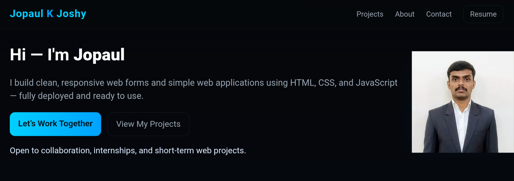

# Portfolio Website

This is my personal portfolio website built to showcase my projects, skills, and learning progress as a beginner web developer.

The site is designed with a dark theme and neon-blue accents, focusing on clean layout, responsiveness, and simplicity.

---

## 🌐 Live Demo
https://portfolio-kuf9.onrender.com

---

## 🛠️ Tech Stack

- HTML5  
- CSS3 (custom styling, responsive design)  
- JavaScript (vanilla)  

---

## ✨ Features

- Responsive layout for desktop and mobile  
- Project showcase with live demo links  
- About section highlighting skills and interests  
- Contact links (GitHub, LinkedIn, Email)  

---

## 🎯 Purpose

This project was built as a learning exercise to:
- Practice frontend structure and styling  
- Improve UI consistency and responsiveness  
- Present projects in a clear and simple way  

---

## 📌 Future Improvements

- Add more project screenshots  
- Improve accessibility  
- Enhance animations and interactions  

---

⭐ Built and maintained by **Jopaul K Joshy**
